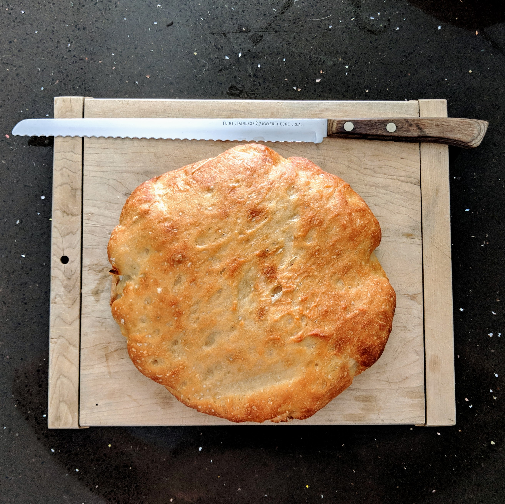

# Sourdough Bread

### Ingredients

#### Dry
- 3 cups flour
- 2 1/4 tsp salt

#### Wet
- 1 3/8 cup water
- 1 Tbsp dry activated yeast
- 2 Tbsp sourdough starter

### Baking

#### Making the dough
1. Mix together dry ingredients in large bowl.
2. Stir together wet ingredients in smaller bowl until yeast is mostly dissolved.
3. Pour wet ingredients into dry.
4. Mix with a spoon until it turns into a ball of dough.

#### Letting dough rise
1. Clean and dry the smaller bowl, coat with a thin layer of canola oil to prevent dough from sticking.
2. Put dough in smaller bowl, roll around to cover dough with oil.
3. Cover dough with plastic wrap to prevent a crust from forming.
4. Let rise overnight.

#### Baking the bread
Welcome to tomorrow morning! Your dough should be much larger than it was last night.
1. Pre-heat oven to 500° F.
2. Line Dutch oven with parchment paper, put dough in there.
3. Bake on middle shelf for 40 mins, with cover on.
4. Uncover, remove parchment paper, and bake for 5 more minutes.
